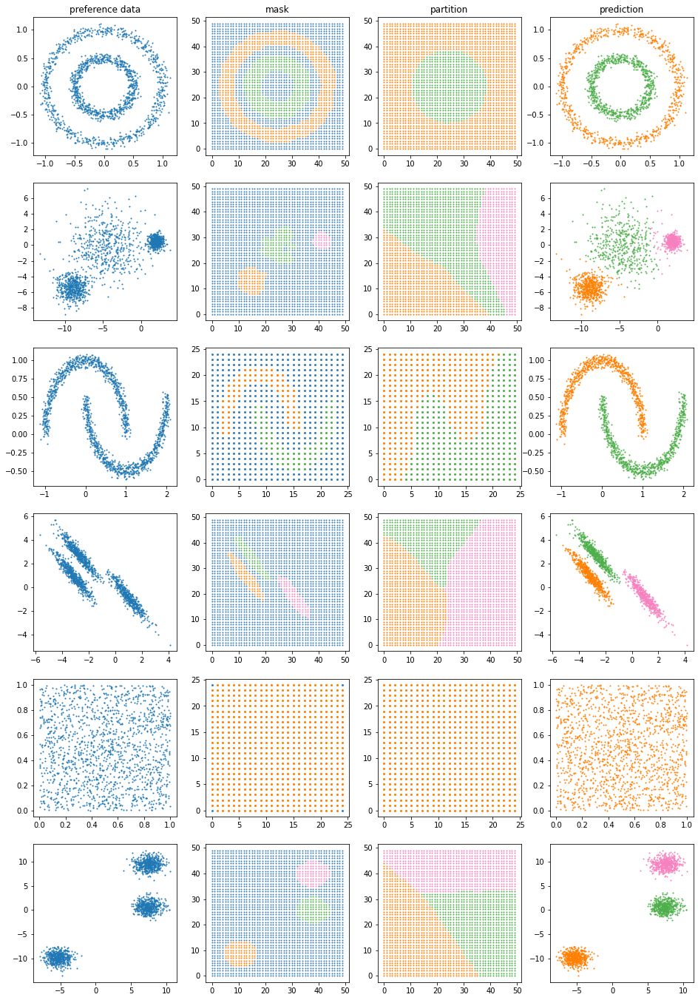

# Heatmap Masking Clustering
The heatmap masking clustering(HMC) is a clustering method based on masking the heatmap generated from the data and the partition of the data space using the mask. 

## Usage
```
>>> data = np.array([
    [0.1,2],
    [0.2,2],
    [0.5,5],
    [0.7,7]
])
>>> cluster = HeatmapClustering([0,0],[1,10],[12,12],0.1,0.1,2,1,10)
>>> cluster.feed(data)
>>> cluster.segment()
>>> print(cluster.predict([[0.6,6]]))
[2]
```

## Examples

## Code
```
## The code to generate the datasets is copied from https://scikit-learn.org/stable/auto_examples/cluster/plot_cluster_comparison.html

import numpy as np
import matplotlib.pyplot as plt

from sklearn import cluster, datasets, mixture
from sklearn.neighbors import kneighbors_graph
from sklearn.preprocessing import StandardScaler
from itertools import cycle, islice
n_samples = 1500
noisy_circles = datasets.make_circles(n_samples=n_samples, factor=.5,
                                      noise=.05)
noisy_moons = datasets.make_moons(n_samples=n_samples, noise=.05)
blobs = datasets.make_blobs(n_samples=n_samples, random_state=8)
no_structure = np.random.rand(n_samples, 2), None

# Anisotropicly distributed data
random_state = 170
X, y = datasets.make_blobs(n_samples=n_samples, random_state=random_state)
transformation = [[0.6, -0.6], [-0.4, 0.8]]
X_aniso = np.dot(X, transformation)
aniso = (X_aniso, y)

# blobs with varied variances
varied = datasets.make_blobs(n_samples=n_samples,
                             cluster_std=[1.0, 2.5, 0.5],
                             random_state=random_state)

colors = ['#377eb8', '#ff7f00', '#4daf4a','#f781bf', '#a65628', '#984ea3','#999999', '#e41a1c', '#dede00']

datasets = [
    noisy_circles,varied,noisy_moons,aniso,no_structure,blobs]

clusters = [
    HeatmapClustering([-1.25,-1.25],[1.25,1.25],[50,50],0.3,0.3,sigma = 2,kernlen=3,epoch = 10),
    HeatmapClustering([-15,-10],[5,7.5],[50,50],0.5,0.5,sigma = 2,kernlen=3,epoch = 10),
    HeatmapClustering([-1.25,-0.75],[2.25,1.25],[25,25],0.5,0.5,sigma = 2,kernlen=3,epoch = 10),
    HeatmapClustering([-6,-5],[5,6],[50,50],0.5,0.5,sigma = 2,kernlen=3,epoch = 10),
    HeatmapClustering([0,0],[1,1],[25,25],0.3,0.3,sigma = 2,kernlen=3,epoch = 10),
    HeatmapClustering([-10,-15],[12.5,15],[50,50],0.3,0.3,sigma = 2,kernlen=3,epoch = 10)]

s = [1,1,4,1,4,1]

plt.figure(figsize = (16,24))

XXX,LBL = None,None

for i in [0,1,2,3,4,5]:
    X,Y = datasets[i]
    cluster = clusters[i]

    cluster.feed(X)
    cluster.segment()
    prediction = cluster.predict(X)

    n = np.max(cluster.partition)

    plt.subplot(6,4,i*4+1)
    plt.scatter(X[:,0],X[:,1],s = 1)

    plt.subplot(6,4,i*4+2)
    for l in range(0,n+1):
        x,y = np.where(cluster.mask==l)
        plt.scatter(x,y,c = colors[l],s = s[i])
    
    plt.subplot(6,4,i*4+3)
    for l in range(0,n+1):
        x,y = np.where(cluster.partition==l)
        plt.scatter(x,y,c = colors[l],s = s[i])

    plt.subplot(6,4,i*4+4)
    for l in range(n+1):
        XX = X[np.where(prediction==l)]
        plt.scatter(XX[:,0],XX[:,1],c = colors[l],s = 1)
```
